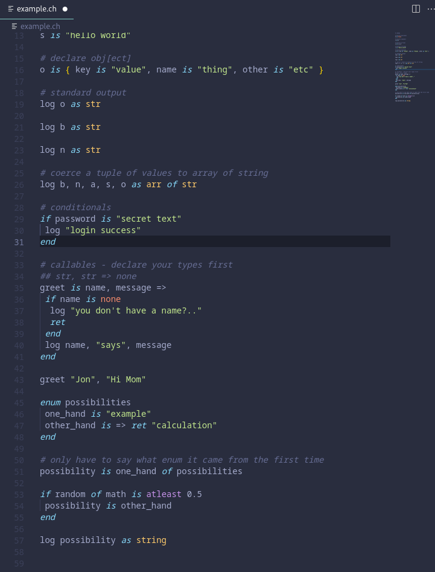

# cheedo-vscode
Syntax highlighting support for the cheedo language

cheedo is a toy language
it has the following goals:
- be easy to read by someone who doesn't code
- be easy to write with limited keyboards (mobile)
- compile to (bootable) x86 assembly

## Features

## Requirements
Don worri abadi

## Extension Settings

Include if your extension adds any VS Code settings through the `contributes.configuration` extension point.

For example:

This extension contributes the following settings:

* `myExtension.enable`: Enable/disable this extension.
* `myExtension.thing`: Set to `blah` to do something.

## Known Issues

Calling out known issues can help limit users opening duplicate issues against your extension.

## Release Notes
